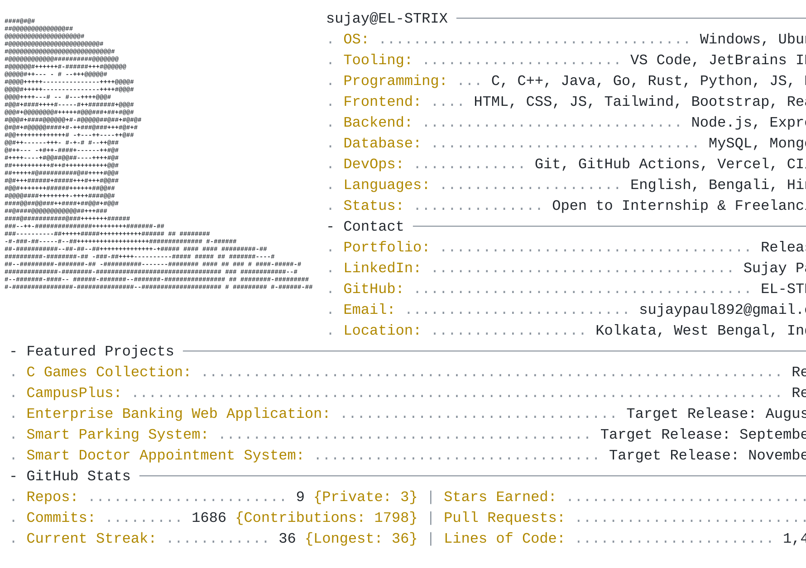

# EL-STRIX 🚀

> GitHub Profile Banner & Dynamic Content Engine

<p align="center">
  <picture>
    <source media="(prefers-color-scheme: dark)" srcset="assets/svg/dark.svg">
    <source media="(prefers-color-scheme: light)" srcset="assets/svg/light.svg">
    
  </picture>
</p>

## 🌟 Overview

**EL-STRIX** is an automated engine designed to generate dynamic GitHub banners, stat cards, and profile README updates.

## 📁 Repository Structure

```
EL-STRIX/
│
├── .github/
│   ├── workflows/
│   │   ├── profile.yml              # Generate/update README
│   │   ├── lint.yml                 # Lint Markdown, YAML, Python
│   │   ├── security.yml             # CodeQL + Secret scanning
│   │   └── release.yml              # Optional release automation
│   │
│   ├── ISSUE_TEMPLATE/
│   │   ├── bug_report.yml
│   │   ├── feature_request.yml
│   │   └── config.yml
│   │
│   ├── PULL_REQUEST_TEMPLATE.md
│   ├── CODEOWNERS
│   └── dependabot.yml
│
├── assets/
│   ├── images/
│   ├── icons/
│   └── svg/
│       ├── light.svg
│       └── dark.svg
│
├── scripts/
│   ├── github.py
│   ├── generator.py
│   ├── renderer.py
│   ├── utils.py
│   └── main.py
│
├── generated/
│   ├── cache/
│   └── data/
│
├── docs/
│   ├── DEVELOPMENT.md
│   └── AUTOMATION.md
│
├── tests/
│   └── test_generator.py
│
├── .editorconfig
├── .gitattributes
├── .gitignore
├── pyproject.toml
├── requirements.txt
├── LICENSE
├── README.md
├── SECURITY.md
├── CONTRIBUTING.md
├── CODE_OF_CONDUCT.md
└── CHANGELOG.md
```

## 🚀 Quick Start

See [docs/DEVELOPMENT.md](docs/DEVELOPMENT.md) for local setup instructions.

## 📄 License

Distributed under the MIT License. See [LICENSE](LICENSE) for details.
